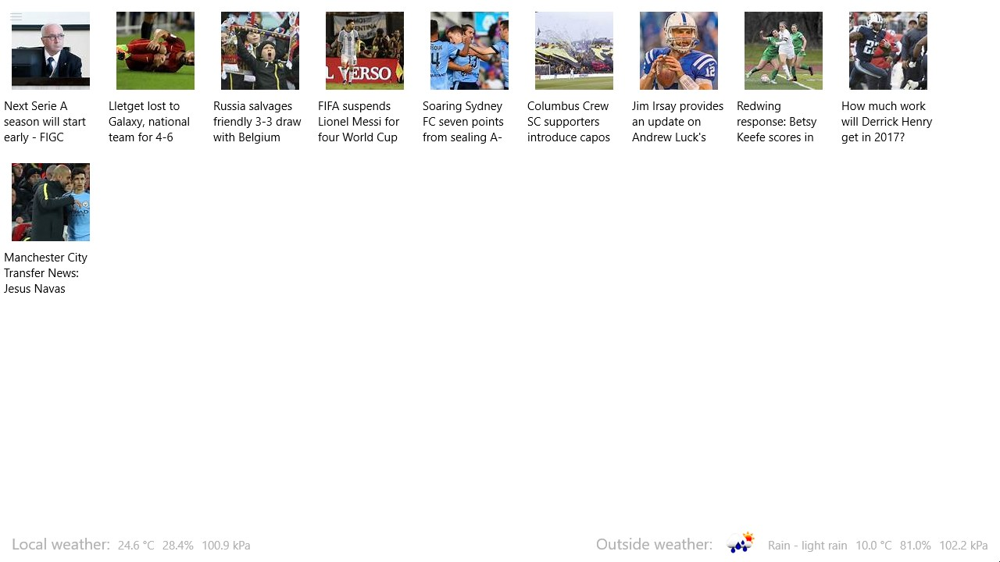

---
---
# Showing local weather data

## Introduction

To finish the app service series of tutorials, we will connect and send weather data from the background to the foreground app. The data will be displayed in the user interface.

## The user interface

We will create a screen to show news and weather from Bing News, the weather shield and OpenWeatherMap. Integration with external services will be done at a later tutorial and only local weather will be populated now.

The interface has one top level `Grid` with two columns and two rows. The bottom row shows a line of weather information and the top row shows a `GridView` with news. The `GridView` uses the two columns and expands to all the available screen height.



Local weather and outside weather data are placed in horizontal `StackPanel`s. [The XAML for this view can be found here.](https://github.com/ms-iot/iot-walkthrough/blob/master/CS/Showcase/Views/NewsAndWeather.xaml)

## Sending data from the background app

Using the [`AppServiceBridge` from previous tutorials](../Creation/README.md) in the background app, we'll edit the background app's `StartupTask.cs` to send sensor data through the app service.

```cs
private async void LogSensorDataAsync(ThreadPoolTimer timer)
{
    var temperature = _station.ReadTemperature();
    var humidity = _station.ReadHumidity();
    var pressure = _station.ReadPressure();

    await AppServiceBridge.SendMessageAsync(new ValueSet
    {
        ["temperature"] = temperature,
        ["humidity"] = humidity,
        ["pressure"] = pressure
    });
}
```

[The full code for the BackgroundStation's `StartupTask` can be found here.](https://github.com/ms-iot/iot-walkthrough/blob/master/CS/BackgroundWeatherStation/StartupTask.cs)

## Receiving data in the foreground app

The foreground app will have a similar `AppServiceBridge.cs`. Small changes are applied to handle the case where the app service is not available at startup or the connection is closed (for example, the background app is not installed yet or is being restarted due to a redeployment). If the connection fails or is lost, it is retried every 1 second. [The `AppServiceBridge.cs` for the foreground app can be found here.](https://github.com/ms-iot/iot-walkthrough/blob/master/CS/Showcase/AppServiceBridge.cs)

After adding the `AppServiceBridge` class, `await AppServiceBridge.InitAsync();` must be called once before using the app service connection. [We add the call to the `Loaded` callback of `MainPage.xaml.cs`.](https://github.com/ms-iot/iot-walkthrough/blob/master/CS/Showcase/Views/MainPage.xaml.cs#L30)

The weather view must install a callback to listen for updates from the app service. After installing the callback, it can request and display the current values from the app service.
The following code is added to the `NewsAndWeather.xaml.cs` file:

```cs
private void OnLoaded(object sender, RoutedEventArgs e)
{
    AppServiceBridge.RequestReceived += PropertyUpdate;
    AppServiceBridge.RequestUpdate(new List<string> { "temperature", "humidity", "pressure" });
}

private void OnUnloaded(object sender, RoutedEventArgs e)
{
    AppServiceBridge.RequestReceived -= PropertyUpdate;
}

private async void PropertyUpdate(AppServiceConnection sender, AppServiceRequestReceivedEventArgs args)
{
    ValueSet message = args.Request.Message;

    if (message.TryGetValue("temperature", out object temperature) | message.TryGetValue("humidity", out object humidity) | message.TryGetValue("pressure", out object pressure))
    {
        await uiThreadDispatcher.RunAsync(CoreDispatcherPriority.Normal, () => {
            if (temperature != null)
            {
                Temperature.Text = FormatTemperature((double)temperature);
            }

            if (humidity != null)
            {
                Humidity.Text = FormatHumidity((double)humidity);
            }

            if (pressure != null)
            {
                Pressure.Text = FormatPressure((double)pressure);
            }
        });
    }
}

private string FormatTemperature(double temperature)
{
    return temperature.ToString("N1") + " °C";
}

private string FormatHumidity(double humidity)
{
    return humidity.ToString("N1") + "%";
}

private string FormatPressure(double pressure)
{
    return pressure.ToString("N1") + " kPa";
}
```

`PropertyUpdate` will be called once with the initial values of the requested properties and later whenever there is an update. [The full code for the news and weather page is available here.](https://github.com/ms-iot/iot-walkthrough/blob/master/CS/Showcase/Views/NewsAndWeather.xaml.cs)
