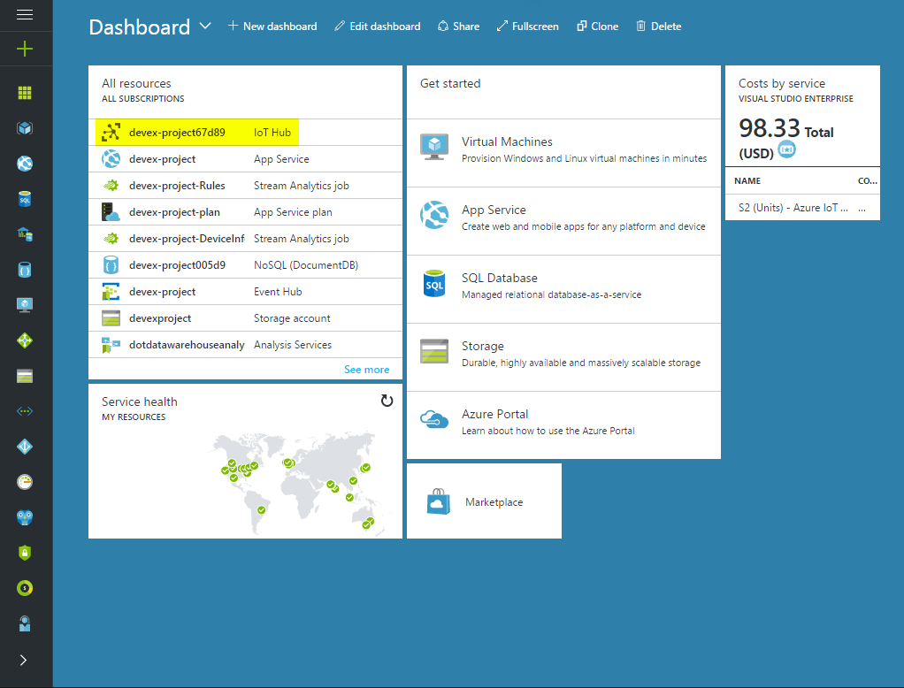

---
---
# Saving application keys on Azure

## Introduction

Keys to access external services (eg. Bing news and OpenWeatherMap) should not be hardcoded in the device. We will save them in Azure and receive them during runtime using the Azure Device Twin.

The Azure connection is managed by the background app and many keys are used by the foreground app; thus, the app service will be used to communicate key updates.

## Device Twin

The Azure Device Twin will be used for storage of keys. The Device Twin works like a cloud representation of the physical device. The back end is allowed to update device properties in the cloud (called Desired Properties) and the device will be informed of the update if it's connected or see the update whenever it powers up. [Documentation is available here.](https://docs.microsoft.com/en-us/azure/iot-hub/iot-hub-devguide-device-twins)

## Listening for changes

To listen for changes, call `SetDesiredPropertyUpdateCallback` at the `DeviceClient` instance. The callback will be called whenever a property is updated. To retrieve the initial state of the whole twin, call `GetTwinAsync` at the `DeviceClient` instance.

For example, after connecting to Azure (using the device ID and key or using TPM tokens), the following sets a callback for updates and calls the callback with the initial state:

```cs
await _deviceClient.SetDesiredPropertyUpdateCallback(OnDesiredPropertyChanged, null);
var twin = await _deviceClient.GetTwinAsync();
await OnDesiredPropertyChanged(twin.Properties.Desired, null);
```

The `OnDesiredPropertyChanged` function must send the property changes through the app service. In this example, we will only support JSON types that can be converted to strings, meaning nested types (objects and arrays) won't be supported:

```cs
private async Task OnDesiredPropertyChanged(TwinCollection desiredProperties, object userContext)
{
    foreach (var prop in desiredProperties)
    {
        var pair = (KeyValuePair<string, object>)prop;
        var value = pair.Value as JValue;
        if (value == null)
        {
            Debug.WriteLine("Twin key " + pair.Key + " has unsupported type");
            continue;
        }
        properties.Add(pair.Key, pair.Value.ToString());
    }
    await AppServiceBridge.SendMessageAsync(properties);
}
```

Applications connected to the app service should listen for app service requests and act upon it. For example, to use keys saved on the Device Twin to fetch news from Bing, the following code can be added to `BingNews.cs`:

```cs
class BingNews
{
    private string _key;

    public BingNews()
    {
        // Install event handler on constructor.
        AppServiceBridge.RequestReceived += PropertyUpdate;
        // Request the current value of bingKey.
        AppServiceBridge.RequestUpdate("bingKey");
    }

    private void PropertyUpdate(AppServiceConnection sender, AppServiceRequestReceivedEventArgs args)
    {
      var message = args.Request.Message;
      if (TryGetValue(message, "bingKey", ref _key))
      {
          // Run a timer to periodically update news.
          InitTimer();
      }
    }
}
```

[The full `BingNews.cs` class is available here.](https://github.com/ms-iot/iot-walkthrough/blob/master/CS/Showcase/BingNews.cs)

## Changing properties

The *Microsoft.Azure.Devices* library can be used to schedule desired properties updates for a single device, a group of devices or all deployed devices. It can be used in an UWP or Console application to programmatically set the application keys that will be available in the cloud. [The Azure documentation and samples to set the device twin in C# is available here.](https://docs.microsoft.com/en-us/azure/iot-hub/iot-hub-csharp-node-schedule-jobs#schedule-jobs-for-calling-a-direct-method-and-updating-a-device-twins-properties)

We will create a console app to set the `bingKey` property in a set of devices. This app can be run on an administrator computer to configure multiple devices.

* Get the connection string that gives full access to your IoT Hub. It will be used to access IoT Hub from your application. [Open the Azure portal](https://ms.portal.azure.com/), click the IoT Hub resource and choose *Shared access policies > iothubowner > Copy Connection string - primary key*.




* Create a new console app by opening *File > New > Project > Templates > Visual C# > Console Application*.
* Right click the project, choose *Manage NuGet Packages...* and install the *Microsoft.Azure.Devices* package.
* Open `Program.cs` and paste the following code to update the `bingKey` property in all devices:

```cs
using Microsoft.Azure.Devices;
using Microsoft.Azure.Devices.Shared;
using System;
using System.Diagnostics;
using System.Threading;
using System.Threading.Tasks;

namespace UpdateTwinCS
{
    class Program
    {
        static string connString = "<connection string here>";
        static JobClient jobClient;

        static void Main(string[] args)
        {
            jobClient = JobClient.CreateFromConnectionString(connString);
            var id = Guid.NewGuid().ToString();
            Debug.WriteLine($"Creating job {id}.");
            StartMethodJob(id).Wait();
            MonitorJob(id).Wait();
            Console.ReadLine();
        }

        public static async Task StartMethodJob(string jobId)
        {
            Twin twin = new Twin();
            twin.Properties.Desired["bingKey"] = "<your key here>";
            twin.ETag = "*";
            var response = await jobClient.ScheduleTwinUpdateAsync(jobId, "", twin, DateTime.Now, 20);
            if (response.Status == JobStatus.Failed || response.Status == JobStatus.Cancelled)
            {
                Console.WriteLine($"Failed to schedule job: {response.Status} - {response.StatusMessage}.");
            }
        }

        public static async Task MonitorJob(string jobId)
        {
            JobResponse response;
            do
            {
                response = await jobClient.GetJobAsync(jobId);
                Thread.Sleep(1000);
                Console.WriteLine($"Job Status : {response.Status.ToString()}.");
            } while (response.Status != JobStatus.Completed && response.Status != JobStatus.Failed && response.Status != JobStatus.Cancelled);
            if (response.Status != JobStatus.Completed)
            {
                Debug.WriteLine($"Job didn't complete: {response.FailureReason}.");
                Console.WriteLine($"Job didn't complete: {response.FailureReason}.");
            }
        }
    }
}

```

* If only a subset of the devices is desired, the second parameter of the `ScheduleTwinUpdateAsync` call receives an IoT Hub query (e.g. `deviceId IN ['devex-showcase']`). [The full documentation for queries is available here.](https://docs.microsoft.com/en-us/azure/iot-hub/iot-hub-devguide-query-language)
