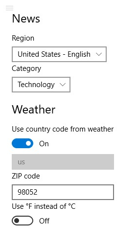

---
---
# Synchronizing settings with Azure

We will synchronize user settings with Azure using the Device Twin's Reported Properties. Settings will be fetched from the cloud and persist even after re-flashing of the board.

## Reported Properties

Reported Properties are a key storage feature of the Device Twin. They can be written and read by the device, but only read by the back end.

The back end can use Reported Properties in IoT Hub queries. For example, one can filter devices by ZIP code or chosen news category.

## Communicating reported properties with Azure

The background app will handle the communication with Azure. To allow the foreground app to make changes to properties (e.g. edition in the settings page), the app service will be used to broadcast the initial value of properties and to transmit any updates.

On the background app, `DeviceClient.UpdateReportedPropertiesAsync` will be used to send new properties to Azure. After fetching the initial twin, `await SendPropertyChange(twin.Properties.Reported, null)` will be called to send the initial values to the app service.

[The code for `IoTHubClient.cs` in the background app can be found here.](https://github.com/ms-iot/iot-walkthrough/blob/master/CS/BackgroundWeatherStation/IoTHubClient.cs)

## Receiving changes through the app service

To differentiate properties that must be persisted from other communication, we will adopt that any key starting with `Config` is a configuration that should be saved to the device twin. The background app will:

* Install a callback for app service messages with `AppServiceBridge.RequestReceived += AppServiceRequestHandler` on the `Run` method of `StartupTask.cs`.
* Filter keys that start with `"Config"` and send them with `UpdateReportedPropertiesAsync`:

```cs
private async void AppServiceRequestHandler(AppServiceConnection connection, AppServiceRequestReceivedEventArgs args)
{
    TwinCollection collection = null;
    foreach (var pair in args.Request.Message)
    {
        if (pair.Key.StartsWith("Config"))
        {
            if (collection == null)
            {
                collection = new TwinCollection();
            }
            collection[pair.Key] = pair.Value;
        }
    }
    if (collection != null)
    {
        await _client.UpdateReportedPropertiesAsync(collection);
    }
}
```

[The code for `StartupTask.cs` can be found here.](https://github.com/ms-iot/iot-walkthrough/blob/master/CS/BackgroundWeatherStation/StartupTask.cs)

## Editing properties from the foreground app

The foreground app has a settings page. Its layout is made of a `StackPanel` of interactable elements (`ComboBox`, `ToggleSwitch` and `TextBox`) and [is available here](https://github.com/ms-iot/iot-walkthrough/blob/master/CS/Showcase/Views/Settings.xaml).



The code for the view is a bit more complicated. We'll have to update the UI on the callback for the app service, but UI updates can only be run from the UI thread. We'll have a helper function `RunOnUi` to make the code more readable:

```cs
using System;
using System.Collections.Generic;
using System.Collections.ObjectModel;
using System.Threading.Tasks;
using Windows.ApplicationModel.AppService;
using Windows.Foundation.Collections;
using Windows.UI.Core;
using Windows.UI.Xaml.Controls;

namespace Showcase
{
    public sealed partial class Settings : Page
    {
        private CoreDispatcher _uiThreadDispatcher;

        public Settings()
        {
            this.InitializeComponent();

            _uiThreadDispatcher = CoreWindow.GetForCurrentThread().Dispatcher;
        }

        private void OnLoaded(object sender, Windows.UI.Xaml.RoutedEventArgs e)
        {
            AppServiceBridge.RequestReceived += PropertyUpdate;
            // Request the current value of the properties used in the settings page.
            AppServiceBridge.RequestUpdate(new List<string> { "ConfigNewsMarket", "ConfigNewsCategory", "ConfigWeatherContryCode", "ConfigWeatherZipCode", "ConfigTemperatureUnit" });
        }

        private void OnUnloaded(object sender, Windows.UI.Xaml.RoutedEventArgs e)
        {
            AppServiceBridge.RequestReceived -= PropertyUpdate;
        }

        private async Task RunOnUi(DispatchedHandler f)
        {
            await _uiThreadDispatcher.RunAsync(CoreDispatcherPriority.Normal, f);
        }
    }
}
```

When the initial value of the properties is received in the app service callback, we have to update the UI to display it. For example, to show the ZIP code that is currently saved in Azure:

```cs
private async void PropertyUpdate(AppServiceConnection sender, AppServiceRequestReceivedEventArgs args)
{
    var message = args.Request.Message;
    if (message.TryGetValue("ConfigWeatherZipCode", out object zip))
    {
        await RunOnUi(() => { Enable(WeatherZipTextBox, (string)zip); });
    }
}

private void Enable(TextBox box, string text = null)
{
    box.IsEnabled = true;
    box.PlaceholderText = "";
    box.Text = text ?? "";
}
```

Whenever the text is updated, a callback is called that sends the new value through the app service:

```cs
private async void WeatherZipTextBox_TextChanged(object sender, TextChangedEventArgs e)
{
    await AppServiceBridge.SendMessageAsync(new ValueSet
    {
        ["ConfigWeatherZipCode"] = ((TextBox)sender).Text
    });
}
```

[The full code for `Settings.xaml.cs` can be found here.](https://github.com/ms-iot/iot-walkthrough/blob/master/CS/Showcase/Views/Settings.xaml.cs)
