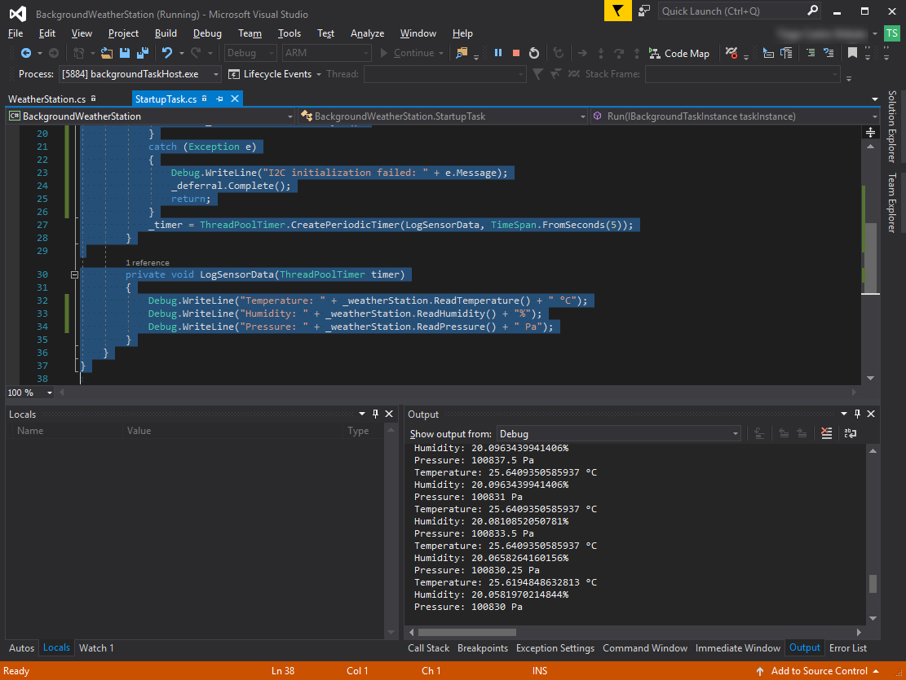

---
---
# Collecting sensor data through I2C

## Introduction

We will be using a weather station connected through I2C to read local weather data. If you need instructions to connect the sensors, [read the page on wiring to the DragonBoard](../../Wiring/README.md).

Datasheets for the sensors are available at:
* [HT21D](https://cdn-shop.adafruit.com/datasheets/1899_HTU21D.pdf): Provides temperature and humidity data.
* [MPL3315A2](http://www.nxp.com/assets/documents/data/en/data-sheets/MPL3115A2.pdf): Provides temperature and pressure data.

## Adding a class for the weather station

Right click the project and choose *Add > New Item...*.


On the dialog, choose a *Visual C# Class* and name it *WeatherStation*.


## Reading pressure data

The will use the pressure data provided by the MPL3315A2. Following the datasheet, we must:

* Set the control register *CTRL_REG1* to an appropriate value depending on the desired measurement mode.
* Read and convert the pressure.

Furthermore, the sensor has a *WHO_AM_I* register for device identification. It's good practice to verify it's value before trying to use the sensor.

We'll start the *WeatherStation* with a few definitions from the datasheet and a function to initialize the sensors. It is assumed that the weather station is connected to the default I2C bus.

```cs
using System;
using System.IO;
using System.Threading.Tasks;
using Windows.Devices.I2c;

namespace BackgroundWeatherStation
{
    class WeatherStation
    {
        private abstract class Mpl3115a2Definitions
        {
            // Datasheet available at http://www.nxp.com/assets/documents/data/en/data-sheets/MPL3115A2.pdf
            public const int ADDRESS = 0x60;
            public const int WHO_AM_I_ID = 0xC4;
            public const int CTRL_REG1 = 0x26;
            public readonly static byte[] PRESSURE_COMMAND = { 0x01 };
            public readonly static byte[] WHO_AM_I = { 0x0C };
        }

        private I2cDevice mpl3115a2;

        public async Task InitAsync()
        {
            var controller = await I2cController.GetDefaultAsync();
            if (controller == null)
            {
                throw new Exception("No I2C controller found");
            }

            mpl3115a2 = controller.GetDevice(new I2cConnectionSettings(Mpl3115a2Definitions.ADDRESS));
            if (mpl3115a2 == null)
            {
                throw new Exception("Failed to open I2C device. Make sure the bus is not in use.");
            }
        }
    }
}
```

Next we have to check the *WHO_AM_I* byte of the MPL3315A2. Some helper functions for reading 8/16/24 bit integers from I2C are handy and make our code much shorter. Add these to the class above:

```cs
private int WriteRead24(I2cDevice sensor, byte[] command)
{
    byte[] data = new byte[3];
    sensor.WriteRead(command, data);
    return data[0] << 16 | data[1] << 8 | data[2];
}

private int WriteRead16(I2cDevice sensor, byte[] command)
{
    byte[] data = new byte[2];
    sensor.WriteRead(command, data);
    return data[0] << 8 | data[1];
}

private int WriteRead8(I2cDevice sensor, byte[] command)
{
    byte[] data = new byte[1];
    sensor.WriteRead(command, data);
    return data[0];
}
```

To check the *WHO_AM_I* register, we call `WriteRead8(mpl3115a2, Mpl3115a2Definitions.WHO_AM_I)` and compare to the expected ID:

```cs
int who_am_i_id;
try
{
    who_am_i_id = WriteRead8(mpl3115a2, Mpl3115a2Definitions.WHO_AM_I);
}
catch (FileNotFoundException)
{
    // First I2C operation might fail if some slave was in a bad state
    who_am_i_id = WriteRead8(mpl3115a2, Mpl3115a2Definitions.WHO_AM_I);
}
if (who_am_i_id != Mpl3115a2Definitions.WHO_AM_I_ID)
{
    throw new Exception("MP13115A2 fails WHO_AM_I test");
}
```

If the sensor ID is valid, we can proceed to enable it. The *CTRL_REG1* has a few fields, which can be seen on page 33 of the datasheet:

| Bit    | 7   | 6   | 5     | 4     | 3     | 2   | 1   | 0    |
|--------|-----|-----|-------|-------|-------|-----|-----|------|
| Symbol | ALT | RAW | OS[2] | OS[1] | OS[0] | RST | OST | SBYB |

We will use the following settings:

| Bit  | Value                                                   |
|------|---------------------------------------------------------|
| ALT  | Set to 0 to use barometer mode instead of altimeter     |
| RAW  | Set to 0 to disable raw measurement mode                |
| OS   | Set to 7 for maximum oversampling (2 ^ 7 = 128 samples) |
| RST  | Set to 0; setting it to 1 would force a software reset  |
| OST  | Set to 0; setting it to 1 triggers a measurement immediately (useful for one shot measurements) |
| SBYB | Set to 1 to quit standby mode                           |

For more details on each bit check the datasheet. The resulting byte is 00111001 = 0x39 in hexadecimal. The following code completes initialization of the sensor:

```cs
// 0x39 = barometer mode, oversampling of 128 samples, ACTIVE mode
// For a full list of flags, see page 33 of the datasheet
byte[] activateCmd = { Mpl3115a2Definitions.CTRL_REG1, 0x39 };
mpl3115a2.Write(activateCmd);
```

Finally, to read the pressure, we must read 3 bytes from register 0x1. According to the datasheet, the lowest 4 bits are reserved (and should be discarded), the next 2 bits contain a fractional part and the highest 18 bits the integer part of the measurement in Pa:

```cs
public double ReadPressure()
{
    /// <summary>Read pressure from MPL3115A2.
    /// <para>Pressure is returned in Pa.</para>
    /// </summary>
    int rawReading = WriteRead24(mpl3115a2, Mpl3115a2Definitions.PRESSURE_COMMAND);
    return (rawReading >> 6) + ((rawReading >> 4) & 3) / 4.0;
}
```

## Reading temperature and humidity data

The HTU21D sensor is very easy to use and doesn't require special setup. Reading the registers for temperature and pressure data will trigger a measurement and return it's value. The following definitions cover the registers that we'll be using:

```cs
private abstract class Htu21dDefinitions
{
    public const int ADDRESS = 0x40;
    public readonly static byte[] TEMPERATURE_COMMAND = { 0xE3 };
    public readonly static byte[] HUMIDITY_COMMAND = { 0xE5 };
}
```

And the conversion formulas have been taken from the datasheet:

```cs
public double ReadTemperature()
{
    /// <summary>Read temperature reading from HTU21D.
    /// <para>Temperature is returned in Celsius degrees.</para>
    /// </summary>
    return -46.85 + (175.72 * WriteRead16(htu21d, Htu21dDefinitions.TEMPERATURE_COMMAND) / 65536.0);
}

public double ReadHumidity()
{
    /// <summary>Read humidity reading from HTU21D.
    /// <para>Humidity is returned in %.</para>
    /// </summary>
    return -6 + (125 * WriteRead16(htu21d, Htu21dDefinitions.HUMIDITY_COMMAND) / 65536.0);
}
```

[The final *WeatherStation* class is available here.](https://github.com/ms-iot/iot-walkthrough/blob/master/CS/BackgroundWeatherStation/WeatherStation.cs)

## Testing on a device

To test the sensors, we can use the background app from the previous tutorial to print their values to the debug output:

```cs
using System;
using Windows.ApplicationModel.Background;
using Windows.System.Threading;
using System.Diagnostics;

namespace BackgroundWeatherStation
{
    public sealed class StartupTask : IBackgroundTask
    {
        private BackgroundTaskDeferral _deferral;
        private ThreadPoolTimer _timer;
        private WeatherStation _weatherStation = new WeatherStation();

        public async void Run(IBackgroundTaskInstance taskInstance)
        {
            _deferral = taskInstance.GetDeferral();
            try
            {
                await _weatherStation.InitAsync();
            }
            catch (Exception e)
            {
                Debug.WriteLine("I2C initialization failed: " + e.Message);
                _deferral.Complete();
                return;
            }
            _timer = ThreadPoolTimer.CreatePeriodicTimer(LogSensorData, TimeSpan.FromSeconds(5));
        }

        private void LogSensorData(ThreadPoolTimer timer)
        {
            Debug.WriteLine("Temperature: " + _weatherStation.ReadTemperature() + " °C");
            Debug.WriteLine("Humidity: " + _weatherStation.ReadHumidity() + "%");
            Debug.WriteLine("Pressure: " + _weatherStation.ReadPressure() + " Pa");
        }
    }
}
```

The output pane should show local weather readings:


