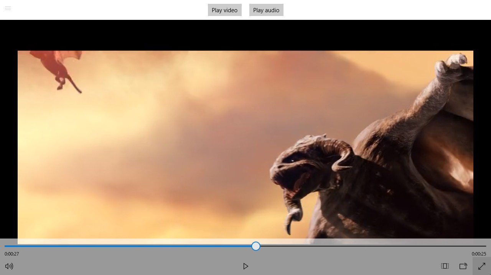

---
---
# Playing media

## Introduction

A media player page capable of playing videos and music will be created, so the device can be used as a media station. The files will be fetched from the board's local folders.

## Layout

The media player page is the most simple in the walkthrough project. It has a `Grid` with a `StackPanel` containing two buttons and a `MediaPlayerElement`. The `MediaPlayerElement` includes the user controls:



[The source code of `MediaPlayerPage.xaml` can be found here.](https://github.com/ms-iot/iot-walkthrough/blob/master/CS/Showcase/Views/MediaPlayerPage.xaml)

## Code

The code for `MediaPlayer.xaml.cs` has callbacks to button clicks and handles the logic to start the next video/song once the current one is done. If a button is clicked, the corresponding folder is listed:

```cs
public sealed partial class MediaPlayerPage : Page
{
    private IReadOnlyList<StorageFile> _fileList;

    private async void PlayAudio_Click(object sender, RoutedEventArgs e)
    {
        _fileList = await KnownFolders.MusicLibrary.GetFilesAsync();
        if (_fileList.Count != 0)
        {
            StartPlayback();
        }
        else
        {
            PlayAudioButton.IsEnabled = false;
            PlayAudioButton.Content = "No files in Music library";
        }
    }

    private async void PlayVideo_Click(object sender, RoutedEventArgs e)
    {
        _fileList = await KnownFolders.VideosLibrary.GetFilesAsync();
        if (_fileList.Count != 0)
        {
            StartPlayback();
        }
        else
        {
            PlayVideoButton.IsEnabled = false;
            PlayVideoButton.Content = "No files in Video library";
        }
    }

    private void StartPlayback()
    {
        _currentFile = 0;
        Player.Source = MediaSource.CreateFromStorageFile(_fileList[0]);
        Player.MediaPlayer.MediaEnded += NextMedia;
        Player.MediaPlayer.MediaFailed += NextMedia;
    }
}
```

The `NextMedia` function will start the next video/song. However, we must ensure it runs on the UI thread, since it changes the UI. We also stop the playback when the user leaves this view:

```cs
public sealed partial class MediaPlayerPage : Page
{
    private CoreDispatcher uiThreadDispatcher = null;
    private IReadOnlyList<StorageFile> _fileList;
    private int _currentFile;

    public MediaPlayerPage()
    {
        this.InitializeComponent();
        uiThreadDispatcher = CoreWindow.GetForCurrentThread().Dispatcher;
    }

    private void OnUnloaded(object sender, RoutedEventArgs e)
    {
        Player.Source = null;
    }

    private async void NextMedia(MediaPlayer sender, object args)
    {
        _currentFile = (_currentFile + 1) % _fileList.Count;
        await uiThreadDispatcher.RunAsync(CoreDispatcherPriority.Normal, () =>
        {
            Player.Source = MediaSource.CreateFromStorageFile(_fileList[_currentFile]);
        });
    }
    }
```

[The source code of `MediaPlayerPage.xaml.cs` can be found here.](https://github.com/ms-iot/iot-walkthrough/blob/master/CS/Showcase/Views/MediaPlayerPage.xaml.cs)

## Running on the board

To copy media to the board:

* Open `\\<Board IP address>\c$\Data\Users\DefaultAccount` in an Explorer window;
* Copy files to the Videos or the Music folder.

Then, run the foreground application and click the buttons to play videos or music!
