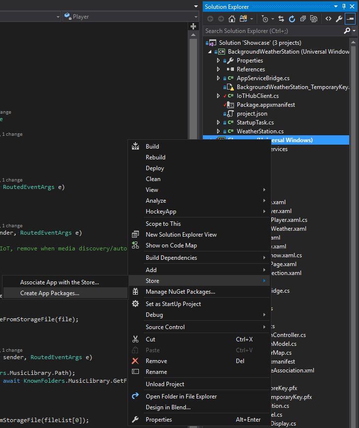

---
---
# IoT image creation

## Introduction

To deploy multiple IoT boards, it is desirable to have a final image of the operating system and all apps and configurations. The device can be ready for deployment after flashing the image, without requiring the installation of apps and settings separately, speeding up the deployment. We will be targeting the Qualcomm DragonBoard in this tutorial.

## Required tools

[Follow the instructions here to download required tools.](https://msdn.microsoft.com/windows/hardware/commercialize/manufacture/iot/set-up-your-pc-to-customize-iot-core) After downloading the ISO with packages and manifests, install the ARM package (*Windows_10_IoT_Core_ARM_Packages.msi*).

Download the DragonBoard packages by contacting a Qualcomm provider.  Save them to `C:\Program Files (x86)\Windows Kits\10\MSPackages\Retail\ARM\fre`.

## Creating a basic image

[Follow the instructions here](https://msdn.microsoft.com/windows/hardware/commercialize/manufacture/iot/create-a-basic-image) up to *Create a test project*. The name *Showcase* will be assumed for the rest of the tutorial; if your project has a different name, replace it accordingly. The default ARM setup targets a Raspberry Pi; to target a DragonBoard, use `newproduct Showcase QCDB410C`. Now, to create and run a basic test image:

* Run `buildimage Showcase Test`. A FFU image will be available at `C:\IoT-ADK-AddonKit\Build\arm\Showcase\Test`.
* Flash it to the DragonBoard using the `DragonBoardUpdateTool`. [More instructions are available here](https://developer.microsoft.com/en-us/windows/iot/docs/getstarted/dragonboard/getstartedstep2).

## Adding apps to the image

[These instructions are also available here.](https://msdn.microsoft.com/en-us/windows/hardware/commercialize/manufacture/iot/deploy-your-app-with-a-standard-board)

Open your solution, right click the desired project and choose *Store > Create App Packages...*.



Choose *No* when asked whether you want to upload to the store. Choose an *Output location* without spaces, *Never* at *Generate app bundle* and keep the *ARM* architecture in *Debug* or *Release* mode.


Inside an *IoTCoreShell*, run `newappxpkg "C:\<Output location>\<Build folder>\<appx file>" fga Appx.Showcase` (e.g. `newappxpkg C:\Users\username\Showcase\AppPackages\Showcase_1.1.1.0_ARM_Test\Showcase_1.1.1.0_ARM.appx Appx.Showcase`). This will create the folder `C:\IoT-ADK-AddonKit\Source-arm\Packages\Appx.Showcase` with files to build your package. The `fga` parameter sets it as the default foreground app (the one shown whenever you boot the board). Run `buildpkg Appx.Showcase` to build it.

To add a second app (for example, the background app for the weather station), use `newappxpkg <Path to BackgroundWeatherStation appx> bgt Appx.BackgroundWeatherStation`. The `bgt` parameter sets it as a startup background task. Build with `buildpkg Appx.BackgroundWeatherStation`.

Open file `C:\IoT-ADK-AddonKit\Source-arm\Packages\OEMFM.xml` and add your package file to the OEM features:

```xml
...
<PackageFile Path="%PKGBLD_DIR%" Name="%OEM_NAME%.Appx.Showcase.cab">
  <FeatureIDs>
    <FeatureID>OEM_AppxShowcase</FeatureID>
  </FeatureIDs>
</PackageFile>
<PackageFile Path="%PKGBLD_DIR%" Name="%OEM_NAME%.Appx.BackgroundWeatherStation.cab">
  <FeatureIDs>
    <FeatureID>OEM_AppxBackgroundWeatherStation</FeatureID>
  </FeatureIDs>
</PackageFile>
...
```

Next, open `C:\IoT-ADK-AddonKit\Source-arm\Products\Showcase\TestOEMInput.xml` and add `<AdditionalFM>%COMMON_DIR%\Packages\OEMCommonFM.xml</AdditionalFM>` and `<AdditionalFM>%SRC_DIR%\Packages\OEMFM.xml</AdditionalFM>` to the `AdditionalFMs` block. Add the required OEM packages to the OEM features (`OEM_AppxMain`, `OEM_CustomCmd`, `OEM_ProvAuto` and `OEM_AppxHelloWorld`) and comment the sample packages. Furthermore, if speech synthesis is desired, [add the desired speech language to the list of features](https://msdn.microsoft.com/en-us/windows/hardware/commercialize/manufacture/iot/iot-core-feature-list#Speech_data).

**Note:** Your app might crash if features are missing. [Check the complete list of features if you need to find a missing feature.](https://msdn.microsoft.com/en-us/windows/hardware/commercialize/manufacture/iot/iot-core-feature-list) There is a limit to the number of times a startup app is allowed to crash before a board reboot is issued; if your app works on a production image but not on an OEM image (eg. app stuck at the loading screen and the board reboots after some time), you are probably missing some feature.

The final manifest should look like:

```xml
<?xml version="1.0" encoding="utf-8"?>
<OEMInput
  xmlns:xsi="http://www.w3.org/2001/XMLSchema-instance"
  xmlns:xsd="http://www.w3.org/2001/XMLSchema"
  xmlns="http://schemas.microsoft.com/embedded/2004/10/ImageUpdate">
  <Description>Windows 10 IoT Core 8016sbc Test FFU generation for arm.fre with build number 20150812-1709 by wesign</Description>
  <SOC>QC8016</SOC>
  <SV>Qualcomm</SV>
  <Device>8016sbc</Device>
  <ReleaseType>Test</ReleaseType>
  <BuildType>fre</BuildType>
  <SupportedLanguages>
    <UserInterface>
      <Language>en-us</Language>
    </UserInterface>
    <Keyboard>
      <Language>en-us</Language>
    </Keyboard>
    <Speech>
      <Language>en-us</Language>
    </Speech>
  </SupportedLanguages>
  <BootUILanguage>en-us</BootUILanguage>
  <BootLocale>en-us</BootLocale>
  <Resolutions>
    <Resolution>1024x768</Resolution>
  </Resolutions>
  <AdditionalFMs>
    <!-- Including BSP feature manifest -->
    <AdditionalFM>%BLD_DIR%\MergedFMs\QCDB410CFM.xml</AdditionalFM>
    <AdditionalFM>%BLD_DIR%\MergedFMs\QCDB410CTestFM.xml</AdditionalFM>
    <!-- Including OEM feature manifest -->
    <AdditionalFM>%BLD_DIR%\MergedFMs\OEMCommonFM.xml</AdditionalFM>
    <AdditionalFM>%BLD_DIR%\MergedFMs\OEMFM.xml</AdditionalFM>
    <!-- Including the test features -->
    <AdditionalFM>%AKROOT%\FMFiles\arm\IoTUAPNonProductionPartnerShareFM.xml</AdditionalFM>
  </AdditionalFMs>
  <Features>
    <Microsoft>
      <Feature>IOT_EFIESP_TEST</Feature>
      <Feature>IOT_KDUSB_SETTINGS</Feature>
      <Feature>IOT_EFIESP_BCD</Feature>
      <Feature>IOT_DISABLEBASICDISPLAYFALLBACK</Feature>
      <Feature>IOT_HWN_CLASS_EXTENSION</Feature>
      <Feature>IOT_USBFN_CLASS_EXTENSION</Feature>
      <Feature>PRODUCTION_CORE</Feature>
      <Feature>IOT_APPLICATIONS</Feature>
      <Feature>PRODUCTION</Feature>
      <Feature>IOT_UAP_OOBE</Feature>
      <Feature>IOT_TOOLKIT</Feature>
      <Feature>IOT_WDTF</Feature>
      <Feature>IOT_SSH</Feature>
      <Feature>IOT_SIREP</Feature>
      <Feature>IOT_WEBB_EXTN</Feature>
      <Feature>IOT_UMDFDBG_SETTINGS</Feature>
      <Feature>IOT_NETCMD</Feature>
      <Feature>IOT_POWERSHELL</Feature>
      <Feature>IOT_DIRECTX_TOOLS</Feature>
      <!-- <Feature>IOT_ALLJOYN_APP</Feature> -->
      <Feature>IOT_ENABLE_TESTSIGNING</Feature>
      <Feature>IOT_DISABLE_UMCI</Feature>
      <Feature>IOT_CRT140</Feature>
      <!-- <Feature>IOT_BERTHA</Feature> -->
      <Feature>IOT_APP_TOOLKIT</Feature>
      <Feature>IOT_CP210x_MAKERDRIVER</Feature>
      <Feature>IOT_FTSER2K_MAKERDRIVER</Feature>
      <!-- <Feature>IOT_ENABLE_ADMIN</Feature> -->
      <Feature>IOT_POWER_SETTINGS</Feature>
    </Microsoft>
    <OEM>
      <Feature>QC_UEFI_TEST</Feature>
      <Feature>SBC</Feature>
      <Feature>QCDB410C_DEVICE_TARGETINGINFO</Feature>
      <Feature>QCDB410C_DEVICE_INFO</Feature>
      <Feature>OEM_CustomCmd</Feature>
      <Feature>OEM_ProvAuto</Feature>
      <Feature>OEM_AppxShowcase</Feature>
      <Feature>OEM_AppxBackgroundWeatherStation</Feature>
    </OEM>
  </Features>
  <Product>Windows 10 IoT Core</Product>
</OEMInput>
```

Set the environment variable `BSPPKG_DIR` to point to the location with BSP packages (e.g. `set BSPPKG_DIR=C:\Program Files (x86)\Windows Kits\10\MSPackages\retail\arm\fre`). Run `buildpkg all` to run the feature merger. Build the image with `buildimage Showcase Test` and your apps will show up after boot!

## Updating apps

To update apps in deployed boards, submit a new version in the Store. A job on the board will check the Store every 24 hours and install updates. [For more information, see the Updating an App section on the store docs.](https://developer.microsoft.com/en-us/windows/iot/docs/store)

Your application can also use an API in the `Windows.Services.Store` namespace to check for new versions and do updates. [Documentation and sample code can be found here.](https://docs.microsoft.com/en-us/windows/uwp/packaging/self-install-package-updates)
