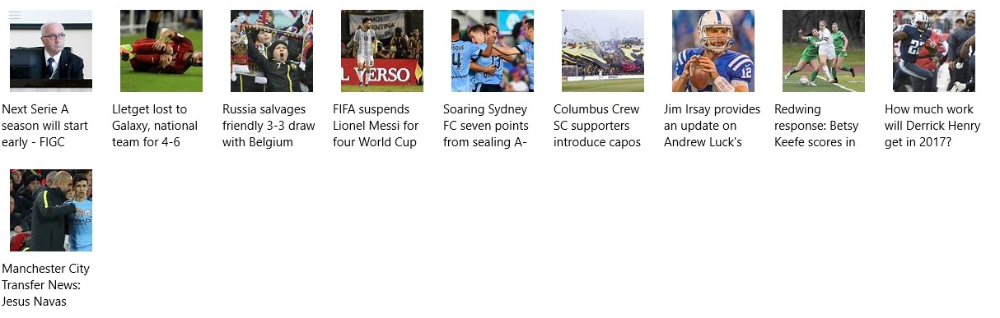

---
---
# Integration with Bing news

## Introduction

We will using the Bing News API to show current news to the user. Region/language and category will be configurable.



## News model

We will have a very simple model class to represent a news item. We are interested in showing the name (header) and thumbnail link of each news. We also need the URL to show the page if the user clicks on an item.

[The model class is available here](https://github.com/ms-iot/iot-walkthrough/blob/master/CS/Showcase/NewsModel.cs) and contains string fields for `name`, `url` and `thumbnail`.

## Bing API

Bing provides a few APIs to fetch news. We will be using the *Category News* API, which receives a category and region and returns a list of news, due to its simplicity. It also has APIs for Trending Topics and a Search API, which receives a search query and returns the results; if you want search results on a specific item, the Search API might be more appropriate. [Check the Cognitive Services documentation for more information.](https://dev.cognitive.microsoft.com/docs/services/56b43f72cf5ff8098cef380a/operations/56f02400dbe2d91900c68553)

First, [open the cognitive services subscription page and create a free subscription](https://www.microsoft.com/cognitive-services/en-US/subscriptions). Click *Subscribe to new free trials >* Check *Bing Search - Free >* check *I agree to the Microsoft Cognitive Services Terms and Microsoft Privacy Statement > Subscribe*. The free quota allows for 5 transactions per second and 1000 per month. A plan can be purchased on Azure if more calls are desired.

As instructed in the Bing docs, we will:

* Do a request to `https://api.cognitive.microsoft.com/bing/v5.0/news/` with parameters `mkt`, representing the market, and optionally `category` to filter to a specific category.
* Add the `Ocp-Apim-Subscription-Key` header field to the request. Its value must be a valid API key.
* Parse the JSON response.

[A list of market codes is available here](https://msdn.microsoft.com/en-us/library/dn783426.aspx) and [a list of categories is available here](https://msdn.microsoft.com/en-us/library/dn760793.aspx#categoriesbymarket). We will save the category in a more readable form with spaces and *-* and convert it to a valid name when doing the request (e.g. Entertainment - Movie And TV -> Entertainment_MovieAndTV). This will be relevant when creating a settings screen that allows the user to choose a category.

A basic class to build the request is:

```cs
class BingNews
{
    private const String ENDPOINT = "https://api.cognitive.microsoft.com/bing/v5.0/news/";
    // Properties
    private string _key;
    private string _market = "en-US";
    private string _category;

    private HttpRequestMessage BuildRequest()
    {
        var uri = $"{ENDPOINT}?mkt={_market}";
        if (!String.IsNullOrEmpty(_category))
        {
            uri += $"&category={_category.Replace(" ", "").Replace("-", "_")}";
        }
        HttpRequestMessage req = new HttpRequestMessage(HttpMethod.Get, uri);
        req.Headers.Add("Ocp-Apim-Subscription-Key", _key);
        return req;
    }

    public EventHandler NewsUpdate;
}
```

Then, [`HttpHelper.TryGetJsonAsync`](https://github.com/ms-iot/iot-walkthrough/blob/master/CS/Showcase/HttpHelper.cs) can be used to parse the JSON response. An `EventHandler` will be called whenever the news are updated:

```cs
public class NewsUpdateEventArgs : EventArgs
{
    private List<NewsModel> _updatedNews;

    public NewsUpdateEventArgs(List<NewsModel> updatedNews)
    {
        _updatedNews = updatedNews;
    }

    public List<NewsModel> UpdatedNews { get { return _updatedNews; } }
}

private NewsModel NewsFromJsonObject(JsonObject json)
{
    string thumbnail = json.GetNamedObject("image", null)?.GetNamedObject("thumbnail").GetNamedString("contentUrl");
    return new NewsModel(json.GetNamedString("name"), json.GetNamedString("url"), thumbnail);
}

private async void FetchNews()
{
    JsonObject json = await new HttpHelper(BuildRequest()).TryGetJsonAsync();
    if (json == null)
    {
        return;
    }

    var jsonNews = json.GetNamedArray("value");
    var news = new List<NewsModel>();
    foreach (var x in jsonNews)
    {
        news.Add(NewsFromJsonObject(x.GetObject()));
    }
    NewsUpdate?.Invoke(this, new NewsUpdateEventArgs(news));
}

public EventHandler NewsUpdate;
```

In the showcase project, a `ThreadPoolTimer` is used to keep updating the news every 5 minutes and invoking `NewsUpdate` with the new content. [The code used in the project is available here.](https://github.com/ms-iot/iot-walkthrough/blob/master/CS/Showcase/BingNews.cs)

## Showing news to the user

A `GridView` will be used to show the news items. Each item will be a `StackPanel` with the thumbnail and the title. A `Bind` will be used to a `ObservableCollection<NewsModel>`. The `ObservableCollection` class behaves like a list, but is observable (callbacks can be added to be called whenever the collection changes). Binding it in a XAML layout will update the layout automatically whenever the data changes. The XAML layout is:

```xml
<GridView ItemsSource="{x:Bind NewsGrid}" ItemClick="News_ItemClick" IsItemClickEnabled="True" Grid.Row="0" Grid.ColumnSpan="2">
    <GridView.ItemTemplate>
        <DataTemplate>
            <StackPanel Width="120" Height="180" Margin="5,5,5,5">
                <Image Width="100" Height="100" Source="{Binding Thumbnail}" Margin="10,10,10,10" />
                <TextBlock Width="120" Height="60" Text="{Binding Name}" TextWrapping="WrapWholeWords" />
            </StackPanel>
        </DataTemplate>
    </GridView.ItemTemplate>
</GridView>
```

[The full XAML layout for the news and weather page is available here.](https://github.com/ms-iot/iot-walkthrough/blob/master/CS/Showcase/Views/NewsAndWeather.xaml)

The `NewsAndWeather.xaml.cs` file must have a `ObservableCollection<NewsModel> NewsGrid` in its `NewsAndWeather` class and update it whenever data changes. Since callbacks to update the UI will be called, the `ObservableCollection` must be updated from the UI thread. Whenever an item is clicked, we open a `WebViewPage` showing the news:

```cs
using System;
using System.Collections.Generic;
using System.Collections.ObjectModel;
using Windows.ApplicationModel.AppService;
using Windows.Foundation.Collections;
using Windows.UI.Core;
using Windows.UI.Xaml;
using Windows.UI.Xaml.Controls;
using Windows.UI.Xaml.Media.Imaging;

namespace Showcase
{
    /// <summary>
    /// Page with customizable news and local/outside weather information.
    /// </summary>
    public sealed partial class NewsAndWeather : Page
    {
        public ObservableCollection<NewsModel> NewsGrid { get { return _news; } }

        private ObservableCollection<NewsModel> _news = new ObservableCollection<NewsModel>();
        private CoreDispatcher uiThreadDispatcher = null;
        private BingNews _bing = new BingNews();

        public NewsAndWeather()
        {
            this.InitializeComponent();
            uiThreadDispatcher = CoreWindow.GetForCurrentThread().Dispatcher;
        }

        private void OnLoaded(object sender, RoutedEventArgs e)
        {
            _bing.NewsUpdate += NewsUpdate;
            _bing.Start();
        }

        private void OnUnloaded(object sender, RoutedEventArgs e)
        {
            _bing.NewsUpdate -= NewsUpdate;
            _bing.Stop();
        }

        private async void NewsUpdate(object sender, EventArgs args)
        {
            BingNews.NewsUpdateEventArgs news = (BingNews.NewsUpdateEventArgs)args;
            await uiThreadDispatcher.RunAsync(CoreDispatcherPriority.Normal, () => {
                _news.Clear();
                foreach (var x in news.UpdatedNews)
                {
                    _news.Add(x);
                }
            });
        }

        private void News_ItemClick(object sender, ItemClickEventArgs e)
        {
            NewsModel news = (NewsModel)e.ClickedItem;
            Frame.Navigate(typeof(WebViewPage), news.Url);
        }
    }
}
```

[The full code for the news and weather page is available here.](https://github.com/ms-iot/iot-walkthrough/blob/master/CS/Showcase/Views/NewsAndWeather.xaml.cs) The `WebViewPage` is a very simple page containing a `WebView` element; [its layout is available here](https://github.com/ms-iot/iot-walkthrough/blob/master/CS/Showcase/Views/WebViewPage.xaml) and [its code here](https://github.com/ms-iot/iot-walkthrough/blob/master/CS/Showcase/Views/WebViewPage.xaml.cs).
