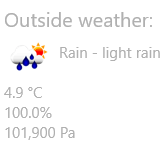

---
---
# Integration with the OpenWeatherMap service

## Introduction

To show local weather information, we will be using the [OpenWeatherMap](https://openweathermap.org/) API. With it we are able to show local temperature, humidity, pressure and a description of the weather. Their API provides much more data, but we will show the user only the most interesting fields. You can see their plan options [here](https://home.openweathermap.org/subscriptions); we will be using the free plan, which provides up to 60 queries per minute.

**Note:** The free plan should be used for demo purposes only, since it doesn't support HTTPS. There is no way to guarantee data hasn't been tampered with before reaching your application.

The final interface will show weather data on the corner of the screen:



## Using the API

* Go to the [OpenWeatherMap signup page](http://home.openweathermap.org/users/sign_up). After you create an account, check your [API keys](https://home.openweathermap.org/api_keys) page and create one. Your API key identifies your application and will be added to all service requests as the `appid` parameter.
* We will use the search by ZIP code API, [available here](https://openweathermap.org/current#zip). We should do a GET request to `http://api.openweathermap.org/data/2.5/weather` with the parameter `zip=<zip code>,<country>`. For example, if you access the address `http://api.openweathermap.org/data/2.5/weather?zip=98052,us&appid=<you API key>` from your browser, you should get weather information for Redmond.
* The format of the weather response is [documented here](https://openweathermap.org/current#parameter). The fields of interest are:

| Field                 | Description                              |
|-----------------------|------------------------------------------|
| `weather.main`        | Name of the weather condition (eg. Snow) |
| `weather.description` | Longer description of weather condition  |
| `weather.icon`        | Weather icon ID                          |
| `main.temp`           | Temperature in Kelvin                    |
| `main.pressure`       | Pressure in hPa                          |
| `main.humidity`       | Humidity in %                            |

Since we will be parsing HTTP JSON responses in our code often, a helper function to do the request and check for errors is handy. [A simple helper is available here and should be trivial to understand](https://github.com/ms-iot/iot-walkthrough/blob/master/CS/Showcase/HttpHelper.cs). The `TryGetJsonAsync` function returns a `Task<JsonObject>` if successful, null otherwise.

Create a `OpenWeatherMap.cs` class. The function to build the request must include parameters specifying the location and app ID:

```cs
class OpenWeatherMap
{
    private const String ENDPOINT = "http://api.openweathermap.org/data/2.5/weather";
    // Properties
    private string _zip;
    private string _country;
    private string _key;

    private HttpRequestMessage BuildRequest()
    {
        Uri uri = new Uri(String.Format("{0}?zip={1},{2}&appid={3}", ENDPOINT, _zip, _country, _key));
        HttpRequestMessage req = new HttpRequestMessage(HttpMethod.Get, uri);
        return req;
    }
```

Create a model class to hold weather data:

```cs
namespace Showcase
{
    class WeatherModel
    {
        public double Temperature { get { return _temperature; } }
        public double Humidity { get { return _humidity; } }
        public double Pressure { get { return _pressure; } }
        public string Condition { get { return _condition; } }
        public string Icon { get { return _icon; } }

        private double _temperature;
        private double _humidity;
        private double _pressure;
        private string _condition;
        private string _icon;

        public WeatherModel(double temperature, double humidity, double pressure, string condition, string icon)
        {
            _temperature = temperature;
            _humidity = humidity;
            _pressure = pressure;
            _condition = condition;
            _icon = icon;
        }
    }
}
```

Then, fetching weather data is easy as:

```cs
private async void FetchWeather()
{
    JsonObject json = await new HttpHelper(BuildRequest()).TryGetJsonAsync();
    if (json == null)
    {
        return;
    }

    JsonObject mainJson = json.GetNamedObject("main");
    JsonObject weatherJson = json.GetNamedArray("weather").GetObjectAt(0);
    string description = weatherJson.GetNamedString("main") + " - " + weatherJson.GetNamedString("description");
    var weather = new WeatherModel(mainJson.GetNamedNumber("temp") - 273.15, mainJson.GetNamedNumber("humidity"),
        mainJson.GetNamedNumber("pressure") * 100, description, String.Format("http://openweathermap.org/img/w/{0}.png", weatherJson.GetNamedString("icon")));
    WeatherUpdate?.Invoke(this, new WeatherUpdateEventArgs(weather));
}
```

[The full class can be found here.](https://github.com/ms-iot/iot-walkthrough/blob/master/CS/Showcase/OpenWeatherMap.cs). The UI to show the weather is implemented in XAML. [The full code can be found here](https://github.com/ms-iot/iot-walkthrough/blob/master/CS/Showcase/Views/NewsAndWeather.xaml), and the excerpt with the weather UI is:

```xml
<StackPanel RelativePanel.AlignBottomWithPanel="True" RelativePanel.AlignRightWithPanel="True">
    <StackPanel Margin="10,10,10,10">
        <TextBlock Text="Outside weather:" Foreground="#aa888888" FontSize="20"/>
        <StackPanel Orientation="Horizontal">
            <Image Name="OutsideIcon" Width="50" Height="50" />
            <TextBlock x:Name="OutsideCondition" Foreground="#aa888888" Margin="5,10,0,0" />
        </StackPanel>
        <TextBlock x:Name="OutsideTemperature" Foreground="#aa888888"/>
        <TextBlock x:Name="OutsideHumidity" Foreground="#aa888888"/>
        <TextBlock x:Name="OutsidePressure" Foreground="#aa888888"/>
    </StackPanel>
</StackPanel>
```

[The full code for the weather and news page is here](https://github.com/ms-iot/iot-walkthrough/blob/master/CS/Showcase/Views/NewsAndWeather.xaml.cs); the code to update the UI copies the data from the model to the view:

```xml
private async void WeatherUpdate(object sender, EventArgs args)
{
    WeatherModel weather = ((OpenWeatherMap.WeatherUpdateEventArgs)args).UpdatedWeather;
    // uiThreadDispatcher is a dispatcher to the UI thread acquired through CoreWindow.GetForCurrentThread().Dispatcher
    await uiThreadDispatcher.RunAsync(CoreDispatcherPriority.Normal, () =>
    {
        OutsideIcon.Source = new BitmapImage(new Uri(weather.Icon));
        OutsideCondition.Text = weather.Condition;
        OutsideTemperature.Text = FormatTemperature(weather.Temperature);
        OutsideHumidity.Text = FormatHumidity(weather.Humidity);
        OutsidePressure.Text = FormatPressure(weather.Pressure);
    });
}
```
