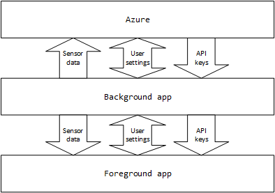
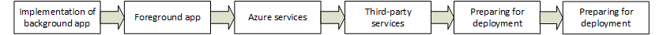

# Developer Experience showcase project

## Introduction

This project's goal is to show intended usage guidelines of Windows on IoT. To fulfill this goal, our solution will have two applications:

* One background application to receive sensor data and send it to the Azure cloud. Receiving sensor data and analyzing it are important tasks in IoT and a device will often operate in "headless" mode for monitoring; thus, we separate these tasks in an independent app. It also receives application keys securely and saves user settings to Azure.
* One foreground application for user interaction. This application shows local weather (read by the background app), information from the internet (news and regional weather) and interacts with the user (playing media or showing a slideshow). A settings page is also available to change settings.

The applications are written using Universal Windows Platform (UWP); thus, the same foreground app can be run on both IoT and Desktop.

## Guides

Steps from implementation of apps to deployment are documented with an end-to-end solution.

1. About the project
    * [Software components](SoftwareComponents.md)
    * [Wiring of weather shield to DragonBoard 410c](Wiring/README.md)
2. Background application
    * [Installing IoT templates and deploying a background app](Background/Installation/README.md)
    * [Collecting sensor data through I2C](Background/Sensing/README.md)
3. Foreground application
    * Creating a foreground application
    * Usage of text-to-speech
    * Receiving voice commands
    * Showing a slideshow
    * Playing media
4. Inter-application communication
    * Creating an app service
    * Connecting to the app service
    * Showing local weather data
5. Connecting to the Azure cloud
    * [Connecting to an Azure IoT Hub using the Preconfigured Remote Monitoring solution](Azure/IoTHubPreconfiguredSolution/README.md)
    * [Saving application keys on Azure](Azure/DeviceTwin/DesiredProperties/README.md)
    * Synchronizing settings with Azure
6. Integration with third-party services
    * [Integration with OpenWeatherMap](Integrations/OpenWeatherMap/README.md)
    * Integration with Bing news
    * [Associating the app with the Windows Store](StoreDeployment/README.md)
    * Showing OneDrive pictures
7. Preparing for deployment
    * [Enabling Secure Boot, BitLocker and ConfigCI](Security/README.md)
    * [Saving Azure keys to the TPM module and connecting with tokens](Security/TPM/README.md)
    * [IoT image creation](ImageCreation/README.md)
8. Deployment
    * [Creating a retail OEM image](ImageCreation/Retail/README.md)
    * Zero touch provisioning
