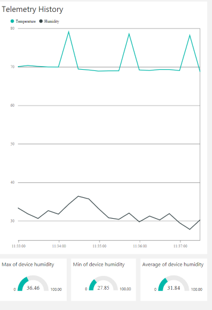
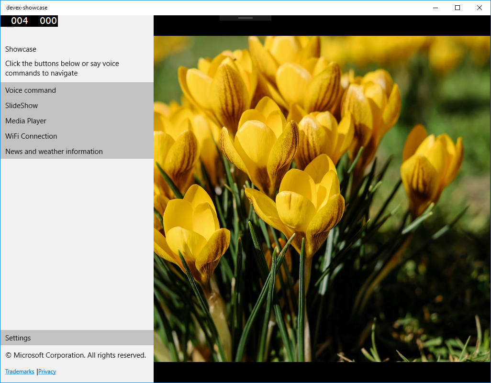

---
---
# Software components

## Applications

The solution has two applications: a background app and a foreground app. The background app collects sensor data and logs it to Azure, while the foreground app communicates with other internet services to show customizable user data. The foreground app should run on both IoT and Desktop.

Furthermore, the solution has a app service to allow communication between the applications. This way, the foreground app can communicate its readings to the foreground app, which displays it to the user. [The full project is available here.](https://github.com/ms-iot/iot-walkthrough)

## External services

The project has some integrations with third-party services, coming from Windows APIs, SDKs available for Universal Windows Platform or use of REST APIs. These allow us to show the user customized information on the foreground app. The following integrations will be used:

| Service               | Used features                                                   |
|-----------------------|-----------------------------------------------------------------|
| Azure                 | Log sensor data, save settings on the cloud and fetch API keys  |
| Open Weather Maps     | Fetch weather condition                                         |
| Bing                  | Displaying current news                                         |
| OneDrive              | Fetch pictures from the user's account                          |

Step by step explanations of each service's setup is given in their respective pages.

## Background app

The background app runs data collection and handles communication with Azure. We will be using event logging features to save local weather data and visualize it in the cloud and the Device Twin to save device properties in the cloud.

## Foreground app

The foreground app has a navigation pane and pages for user interaction, connectivity and settings.

