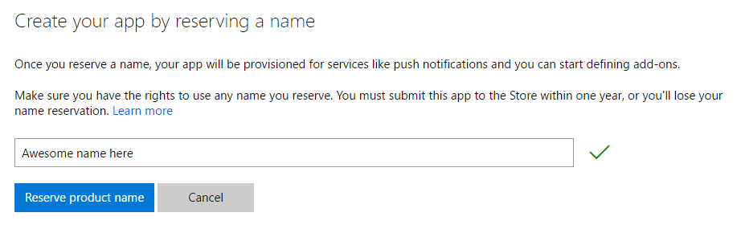
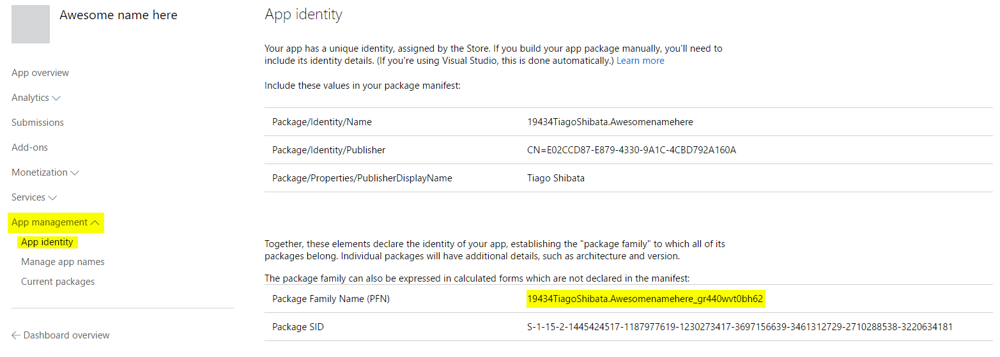

---
---
# Associating the app with the Windows Store

It is necessary to associate the application with the Windows Store to access some services (such as OneDrive). The foreground app will be associated with the Store to be able to access user pictures.

Associating with the Store changes the **Package Family Name**, which is an identifier that we will need to create an app service for communication between the background and the foreground applications; therefore, if an app service is to be placed on the foreground app, it is easier to associate with the Store before writing the app service.

## Requirements

A developer account in the Windows Store is required; [follow these instructions to get one](https://docs.microsoft.com/en-us/windows/uwp/publish/opening-a-developer-account)

## Steps

It is very easy to create an app on the Windows Store:
* [Go to the developer dashboard.](https://developer.microsoft.com/en-us/dashboard)
* Click the *Create a new app* button and choose a name. Click *Reserve product name*.

That's all! To get the Package Family Name, click *App management* and choose the *App identity* sub-item. Take note of this identifier, which will be used when connecting to the app service.

# Associating the app with the Store

Whenever you need to associate your app with the Store, right click your project and choose *Store > Associate App with the Store...* and follow the instructions. You will have to login with the same Microsoft account used to create the app.

