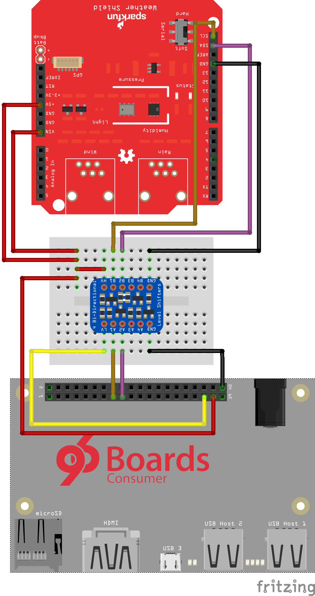

# Wiring of weather shield to DragonBoard 410c

### Introduction
In this project, we will use a weather shield containing a HTU21D(F) humidity and temperature sensor and a MPL3115A2 pressure sensor connected to a I2C bus. We will use the [SparkFun weather shield](https://www.sparkfun.com/products/12081), which provides these two sensors and a light sensor. The GPIO of the DragonBoard includes the required I2C buses and 5V port to power the shield.

### Components
To connect the sensor to the DragonBoard, a level shifter will be necessary. The DragonBoard GPIO operates at 1.8V, while the weather shield outputs operate at 5V. A bidirectional level shifter is required due to the open drain nature of I2C, where both the master or the devices might pull the line low. A [Adafruit 4-channel I2C-safe Bi-directional Logic Level Converter](https://www.adafruit.com/product/757) will be used.
* [Adafruit 4-channel I2C-safe Bi-directional Logic Level Converter](https://www.adafruit.com/product/757)
* [SparkFun weather shield](https://www.sparkfun.com/products/12081)
* Breadboard
* Male/male jumper wires

## Wiring
The Fritzing project with the connections [can be downloaded here](Wiring.fzz).

* The GND signals of both boards are connected.
* On the DragonBoard side, LV is connected to 1.8V, and A1 and A2 are connected to SCL and SDA, respectively.
* On the weather shield side, HV is connected to 5V, and B1 and B2 are connected to SCL and SDA, respectively.
* The DragonBoard's 5V output is connected to 5V and VIN of the weather shield.
